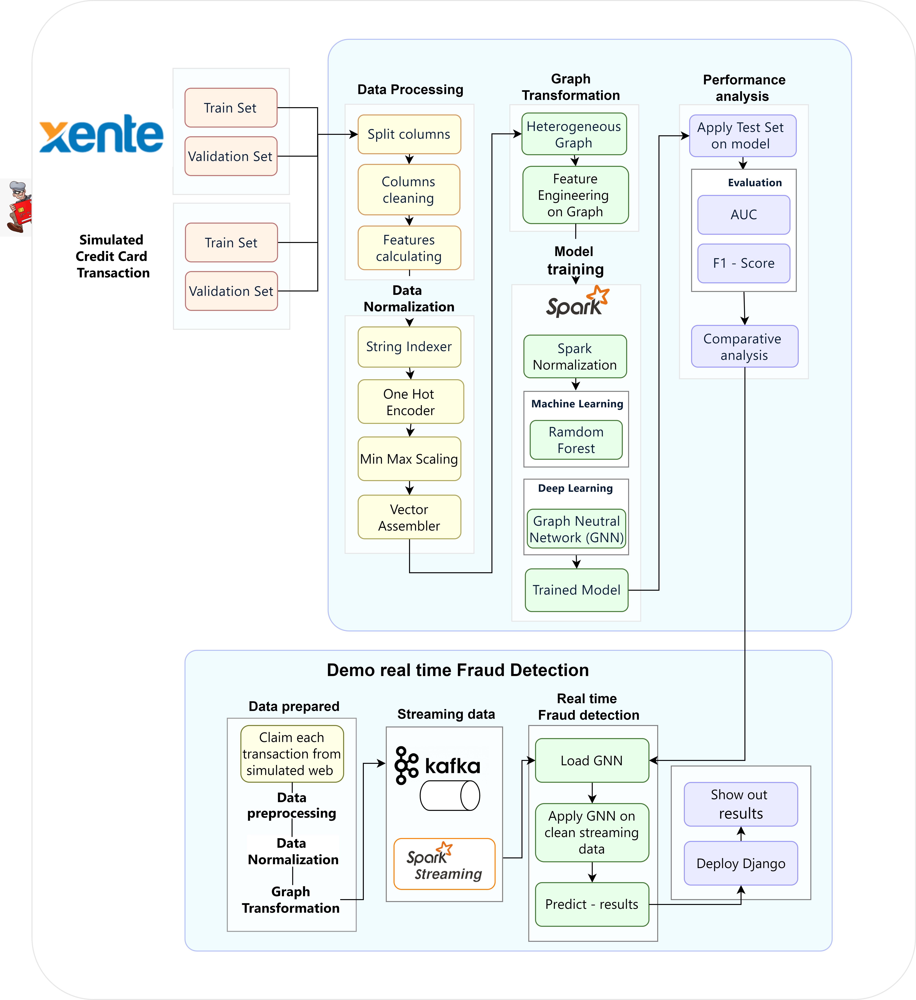
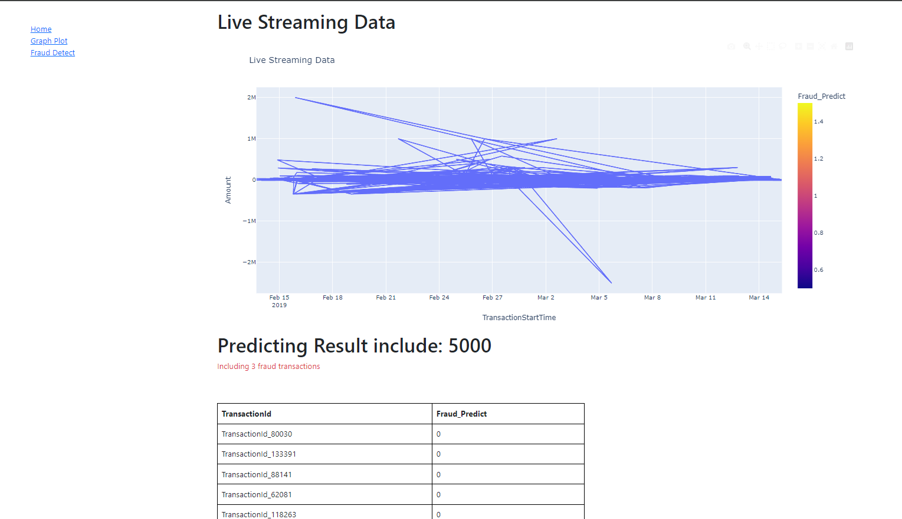

# Fraud-Detection
 Financial fraud detection using Graph Neural Networks on DGL with Kafka Streaming.
  
1. Dataset
  * [Xente](https://zindi.africa/competitions/xente-fraud-detection-challenge/data) is an e-commerce and financial service app serving 10,000+ customers in Uganda.
  * This dataset includes a sample of approximately 140,000 transactions that occurred between 15 November 2018 and 15 March 2019.
2. Abstract
  * The detection of financial fraud has become increasingly crucial in an era where digital financial transactions are rapidly evolving. This study introduces a modern approach utilizing Graph Neural Networks (GNN) and Kafka Streaming to enhance fraud detection capabilities. We constructed a framework integrating GNN into the analysis of the graph of financial transactions, modeling complex relationships among related factors. Integration with Kafka Streaming supports real-time data processing and analysis, enhancing flexibility in detecting dynamic fraudulent behaviors.
  
